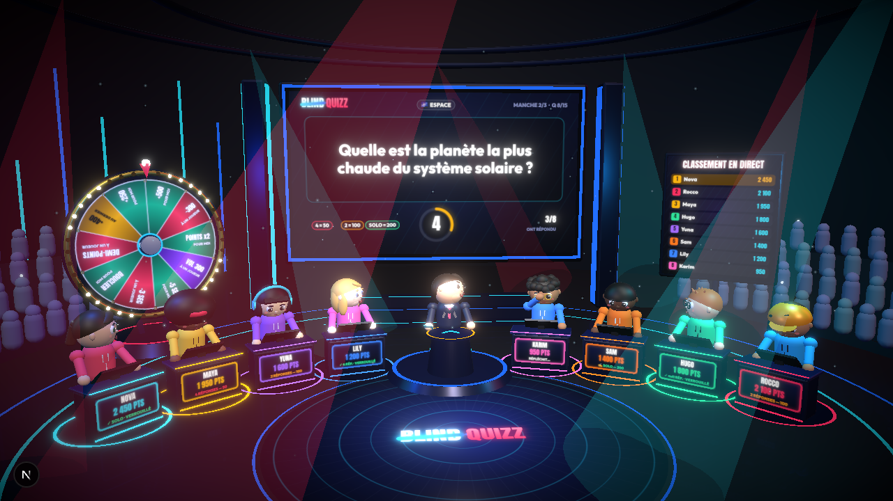
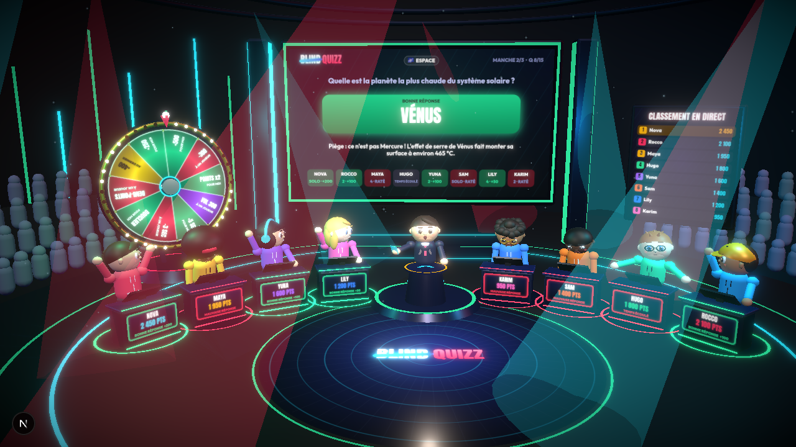
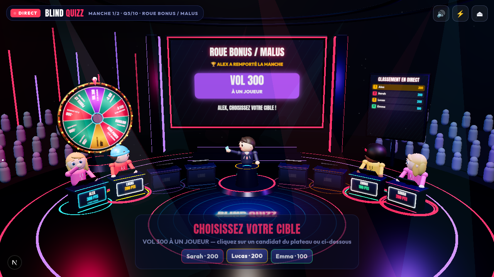
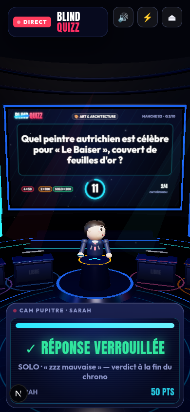

# BLIND QUIZZ — jeu télévisé 3D multijoueur

> « Je regarde une vraie émission de télévision, sauf que je suis moi-même candidat. »

BLIND QUIZZ est un jeu de culture générale en ligne mis en scène comme une émission TV : un plateau 3D
avec animateur, grand écran, pupitres, public, lumières de studio et roue bonus/malus. Jusqu'à 8 candidats
jouent en même temps depuis un ordinateur, une tablette ou un smartphone.



| Révélation | Choix d'une cible après la roue | Smartphone |
|---|---|---|
|  |  |  |

## Le principe : choisir son aide

Chaque question dure **12 secondes au total** : réfléchir, choisir son niveau d'aide et répondre.
Choisir l'aide ne donne aucun temps supplémentaire.

| Aide | Ce que voit le candidat | Points |
|------|-------------------------|--------|
| 🟠 **2 RÉPONSES** — plus de sécurité | la bonne réponse + la mauvaise réponse la plus crédible | **50** |
| 🔵 **4 RÉPONSES** — plus de possibilités | 4 propositions | **100** |
| 🟢 **SOLO** — aucun filet de sécurité | aucune proposition, on écrit la réponse | **200** |

Mauvaise réponse ou temps écoulé : 0 point, jamais de points négatifs. À zéro, le grand écran, les pupitres et
la console affichent **« LES RÉPONSES SONT VERROUILLÉES »** avant de révéler la bonne réponse.

Le chrono est affiché en grand sur l'écran géant (anneau + barre pleine largeur), sur l'écran du pupitre et en
habillage d'antenne en haut de l'image ; il bat à chaque seconde et passe au rouge sur les 3 dernières, avec un
tic-tac qui monte en tension et un battement de cœur final.

Une **manche** = 5 questions → classement animé → **roue bonus/malus** tournée par le meilleur de la manche.
De 1 à 6 manches (5 à 30 questions), puis grande finale. **Personne n'est éliminé.**

## Démarrer

```bash
npm install
npm run dev          # http://localhost:3000 — plateau, jeu temps réel et régie /admin sur le même port
```

### Voir une partie tout de suite (partie de démonstration)

Ouvrez **http://localhost:3000/?partie-test** : une émission démarre immédiatement avec **Alex** (vous, en pilote
automatique) et trois candidats simulés, **Sarah**, **Lucas** et **Emma**. Ils réfléchissent, choisissent 2 / 4 / SOLO,
répondent juste ou faux, oublient parfois de répondre, tournent la roue et choisissent leurs cibles : il suffit de regarder.

- `?partie-test&manches=3` pour une émission plus longue (1 à 6 manches), `&pseudo=Léa&perso=nova` pour changer de candidat ;
- depuis l'accueil : bouton **« ▶ Regarder une partie de démonstration »** ;
- dans le lobby, l'hôte peut aussi **ajouter 3 candidats simulés** et activer **« Pilote automatique »** ; pendant la
  partie, le badge « PILOTE AUTO · reprendre la main » de la console permet de rejouer soi-même.

Les candidats simulés sont joués **par le serveur** et respectent exactement les mêmes règles que les humains
(12 secondes, verrouillage, barème) : aucune triche possible côté navigateur.

Production :

```bash
npm run build
ADMIN_PASSWORD=… npm start
```

Variables d'environnement : voir [`.env.example`](.env.example).

## Parcours

1. **Accueil** : pseudo + choix parmi 12 personnages 3D (aperçu animé), nombre de manches.
2. **Créer une émission** → code `BQ-XXXX` + lien d'invitation. Les autres **rejoignent** avec le code.
3. Chaque candidat apparaît sur **son pupitre** dans le décor ; l'hôte lance l'émission.
4. Générique → annonce de manche → pour chaque question : l'animateur annonce, le **grand écran** affiche
   la question et le chrono ; chacun choisit **2 / 4 / SOLO** sur l'écran de son pupitre et répond.
5. Révélation : bonne réponse, explication, réactions des personnages, scores qui défilent.
6. Après 5 questions : classement animé puis **roue** ; si l'effet vise un adversaire, les candidats deviennent
   sélectionnables (clic sur le personnage ou sur son nom).
7. Finale : classement final sur podium, confettis, animation du vainqueur, bouton « Rejouer ».

Raccourcis clavier pendant une question : `1` (2 réponses) `2` (4 réponses) `3` (SOLO), `A` `B` `C` `D` pour les propositions.

## Le plateau

- **Vraie 3D** (React Three Fiber / three.js) : plateau en « U » ouvert vers le public, animateur au centre,
  grand écran, roue physique, panneau LED « classement en direct », gradins de public, faisceaux, particules,
  sol réfléchissant et bloom (qualité haute).
- **Personnages procéduraux** (aucun fichier à télécharger) : respiration, clignements, regard dirigé
  (animateur, écran du pupitre, roue, caméra), et émotions — réflexion, concentration, joie, euphorie,
  déception, surprise, haussement d'épaules, applaudissements, victoire.
- **Pupitres** : la façade affiche en permanence **PSEUDO + SCORE** (avec défilement animé du score) et l'état
  (réfléchit / mode choisi / verrouillé / bonne ou mauvaise réponse). Un écran incliné, orienté vers le candidat,
  affiche son interface personnelle (chrono, 2 / 4 / SOLO, propositions). Tous ces écrans sont des textures
  intégrées aux objets 3D, pas des fenêtres HTML flottantes.
- **« CAM PUPITRE »** : en bas de l'écran, un gros plan de l'écran de votre pupitre sert d'interface tactile
  (indispensable sur smartphone pour taper une réponse SOLO). Le plateau reste toujours visible au-dessus.
- **Réalisation automatique** : caméras PLATEAU, ANIMATEUR, QUESTION, CANDIDATS, JOUEUR, ROUE, CLASSEMENT et grue ;
  cadrage adapté aux écrans portrait.
- **Habillage sonore synthétisé** (Web Audio) : génériques, musique de réflexion, tic-tac des 5 dernières
  secondes, sons de choix d'aide, bonne/mauvaise réponse, gain de points, roue (clic-clic-clic), bonus, malus,
  roulement de tambour, fanfare, applaudissements.
- **Qualité** ✨/⚡ : haute (bloom, réflexions) ou économie (mobiles), bascule automatique si l'appareil peine.

## Architecture

```
server/            Serveur Node (tsx) : Next.js + WebSocket /ws + API admin sur un seul port
  game/room.ts       Moteur autoritaire d'une partie (phases, chronos, scores, roue, effets)
  game/answer.ts     Correction des réponses SOLO (casse, accents, articles, fautes de frappe)
  game/selection.ts  Tirage des questions (difficulté progressive, variété des catégories)
  game/rooms.ts      Rooms + transport WebSocket, reprise de session après coupure
  store/             Stockage des questions : fichier JSON local ou Supabase (Postgres)
  admin/             API de la régie + génération IA (Claude)
shared/            Types, règles (points, timings), catégories, personnages, roue
data/questions/    Base initiale : 566 questions rédigées à la main, 30 catégories
src/               Interface Next.js (App Router) : plateau 3D, HUD, console candidat, régie /admin
supabase/          Migration SQL (questions + statistiques + historique)
tests/             Tests unitaires (vitest) du moteur et de la correction
e2e/full-game.ts   Test de bout en bout : 2 navigateurs + 2 bots jouent une vraie partie
```

### Le serveur est la source de vérité

Le navigateur n'envoie que des **intentions** (`mode`, `answer`, `spin`, `target`). Le serveur décide seul :

- de la question et de la bonne réponse — elle n'est **jamais envoyée avant la révélation** ;
- du texte de la question, envoyé **au démarrage du chrono** (personne ne gagne de temps de réflexion) ;
- des propositions de chaque joueur, envoyées **en privé** selon son mode ;
- du chrono (horodatage serveur, tolérance réseau de 350 ms, aucune réponse acceptée après) ;
- du verdict, des points, des multiplicateurs, du classement ;
- du résultat de la roue (tiré avant l'animation), de la cible par défaut et de l'effet appliqué.

### Temps réel

Le jeu utilise un **WebSocket** servi par le même processus Node que Next.js. Ce choix est délibéré :
un jeu autoritaire a besoin d'un processus qui fait tourner les chronos et garde l'état des parties ;
un WebSocket permet aussi d'envoyer des messages **privés** à un seul joueur (ses propositions), ce qui
évite toute fuite d'information. **Supabase** est utilisé comme base de données (questions, statistiques).
Brancher Supabase Realtime comme transport resterait possible (canal de broadcast par room, le serveur
restant l'autorité), mais ce n'est pas implémenté aujourd'hui.

### Déploiement

Le serveur de jeu a besoin d'un hôte Node qui garde des WebSockets ouverts (Railway, Render, Fly.io, un
VPS…). Vercel n'exécute pas `server/index.ts` : l'interface s'affiche mais les parties restent sur
« connexion perdue ».

**Railway depuis votre ordinateur** : `npm run deploy:railway`. Le script ouvre la connexion Railway dans le
navigateur (vous vous connectez vous-même), crée le projet et le service `blind-quizz`, envoie les variables
de `.env.local` (demande le mot de passe de la régie s'il manque), déploie et affiche l'adresse publique.
Le relancer redéploie la version actuelle du code.

**Railway depuis le site** (fichier `railway.json` fourni) : *New Project → Deploy from GitHub repo*, puis dans *Variables*
`SUPABASE_URL`, `SUPABASE_SERVICE_ROLE_KEY`, `ADMIN_PASSWORD`, et *Settings → Networking → Generate Domain*.
Le build (`npm run build`) et le démarrage (`npm start`) sont automatiques ; `/api/health` sert de sonde.
Le jeu complet (interface, parties, régie) est alors disponible sur l'adresse Railway.

**Garder l'interface sur Vercel** : ajouter dans Vercel `NEXT_PUBLIC_GAME_SERVER_URL=https://<adresse-railway>`
puis redéployer. Les parties se connectent au serveur Railway et l'API de la régie y est relayée.

Sans Supabase, les questions sont stockées dans `data/store/questions.json`, qui est réinitialisé à chaque
redéploiement sur ces hébergeurs : branchez Supabase pour conserver les modifications de la régie et les statistiques.

## Roue bonus / malus

Le **meilleur de la manche** (points marqués pendant les 5 questions — à égalité, avantage au moins bien
classé au général) tourne la roue. S'il ne la lance pas en 12 s, elle part toute seule ; s'il ne choisit pas
de cible en 15 s, le serveur tire une cible au hasard. Il n'y a pas de roue après la dernière manche.

| Case | Effet |
|------|-------|
| +500 / +250 POUR MOI | points immédiats |
| POINTS x2 POUR MOI | points doublés pendant toute la manche suivante |
| +5 SEC POUR MOI | 17 s par question pendant la manche suivante |
| BOUCLIER POUR MOI | annule le prochain malus reçu |
| +400 AU DERNIER | coup de pouce au(x) dernier(s) du classement |
| -300 À UN JOUEUR | points retirés (jamais sous 0) |
| -3 SEC À UN JOUEUR | 9 s par question pendant la manche suivante (minimum 7 s) |
| DEMI-POINTS À UN JOUEUR | points divisés par 2 pendant la manche suivante |
| VOL 300 À UN JOUEUR | transfert de 300 points (au plus le score de la cible) |

Équilibrage : effets bornés (multiplicateur entre ×0,5 et ×2, score jamais négatif, chrono jamais sous 7 s),
une seule roue par manche, et une case de rattrapage : un joueur distancé peut toujours revenir.

## Les questions

566 questions rédigées à la main (274 faciles, 166 moyennes, 94 difficiles, 32 très difficiles), réparties sur 30 catégories (géographie, France, histoire, sciences,
espace, animaux, sport, football, basket, tennis, automobile, cinéma, séries/TV, musique, jeux vidéo,
technologie, cuisine, littérature, art, économie/marques, vie quotidienne, insolite, questions pièges,
records, voyages…). Chaque question stocke réellement :

```ts
{
  id, question, category, difficulty /* 1 facile · 2 moyen · 3 difficile · 4 très difficile */,
  correctAnswer, acceptedAnswers /* variantes SOLO */,
  wrongAnswers /* 3 mauvaises réponses crédibles, la 1re sert au mode 2 */,
  explanation, status /* published | draft | disabled */,
  stats: { timesUsed, answers, correct, timeouts, byMode }
}
```

`npm run questions:validate` contrôle la base : doublons, 3 mauvaises réponses distinctes, et surtout
qu'**aucune mauvaise réponse ne serait acceptée en SOLO** par la correction tolérante (ce contrôle a permis
de rendre la correction stricte sur les nombres, les chiffres romains et les lettres : « Louis XVI » n'est pas
« Louis XIV », « -4 °C » n'est pas « 4 °C », « A négatif » n'est pas « O négatif »).

### Régie `/admin`

Mot de passe : `ADMIN_PASSWORD` (« admin » par défaut en développement). Voir, rechercher, filtrer
(catégorie, difficulté, statut), trier (taux de réussite, plus jouées…), modifier avec aperçu des trois
niveaux d'aide, publier, désactiver, supprimer, ajouter, **importer** du JSON, et **générer** avec l'IA
(« 50 questions de géographie niveau moyen ») : les questions générées arrivent en **brouillon** et doivent
être relues avant publication. Statistiques par question : nombre de parties, réponses en mode 2 / 4 / SOLO, taux de réussite et d'erreur ; les questions trop faciles ou trop dures sont signalées (≥ 10 réponses).

### Supabase

```bash
# 1. appliquer supabase/migrations/001_blind_quizz.sql (SQL editor ou supabase db push)
# 2. charger la base initiale
SUPABASE_URL=… SUPABASE_SERVICE_ROLE_KEY=… npm run supabase:seed
# 3. lancer le serveur avec ces mêmes variables : le stockage bascule automatiquement sur Supabase
```

La clé `service_role` reste côté serveur ; la RLS est activée et aucune règle n'ouvre les questions au
navigateur (sinon les bonnes réponses fuiteraient).

Tous les objets sont préfixés `bq_` (`bq_questions`, `bq_games`, `bq_question_success`, `bq_record_*`) :
le jeu peut donc partager un projet Supabase existant sans toucher aux autres tables.

## Tests

```bash
npm test                    # moteur (manche complète, 2/4/SOLO, expiration, roue, bouclier, vol, partie de 30 questions…)
npm run questions:validate  # contrôle qualité de la base de questions
npm run dev & npm run e2e   # partie réelle : 2 navigateurs (ordinateur + smartphone) + 2 bots
ROUNDS=6 npm run e2e        # la même chose sur une émission complète de 30 questions
node e2e/watch-demo.mjs dossier 1920 1080 2   # regarde une partie de démonstration et capture l'écran
```

Le test de bout en bout joue une vraie partie de 2 manches avec 4 candidats et vérifie : création de room,
arrivée sur le plateau, modes 2 / 4 / SOLO, bonnes et mauvaises réponses, saisie SOLO sans accents ni majuscules,
expiration des 12 secondes, calcul des points, synchronisation des scores entre joueurs, pupitres fixes,
classement, roue lancée par le gagnant, choix d'une cible, effet appliqué, nouvelle manche, finale.
Des captures de chaque étape sont écrites dans `e2e/screenshots/`.

Aperçu d'une phase sans jouer : `/?demo=question` (ou `reveal`, `leaderboard`, `wheel`, `final`).
`?quality=high|low` force la qualité graphique, `?fps=10` limite la cadence d'affichage.
